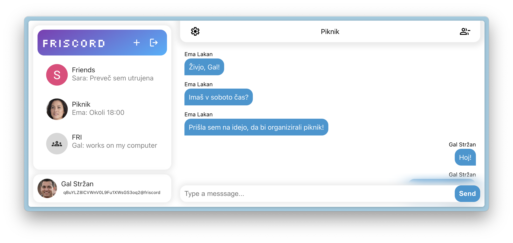

# Friscord

Friscord is a real-time instant messaging service for easy text communication between users. It uses Firebase Firestore for the backend, Google SSO for user login and React as a frontend framework.

## Deployment

A GitHub Pages deployment of the app can be accessed at [https://fr33bits.github.io/friscord/](https://fr33bits.github.io/friscord/).

The client can also be deployed locally:

1. Open the CLI in the directory where you want the project.
2. Run `git clone https://github.com/fr33bits/friscord.git`.
3. Install the necessary packages by running the `npm i` command.
4. Set up a development server using the `npm serve`command.
5. A new browser window should open with the app.

## Known issues and work in progress

- Recent versions of `firebase-js-sdk` contain a bug where `heartbeats undefined` is printed out several times in the console. See [here](https://github.com/firebase/firebase-js-sdk/issues/8436) for more information. The package version needs to be updated when a fix is released.
- Lack of mobile support
- Cross-service texting
